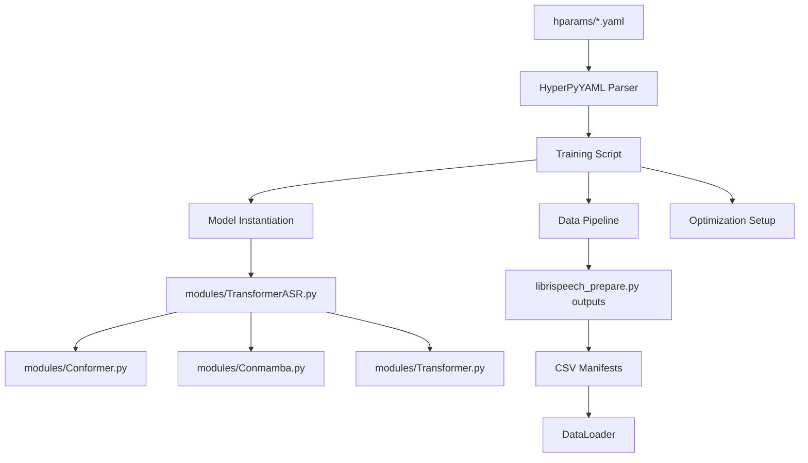

# Mamba-ASR System Integration Guide

## Overview

This guide provides comprehensive documentation of how all components in the Mamba-ASR system integrate to form a complete automatic speech recognition pipeline. Following AI-first documentation principles, this guide enables the next developer (who is an AI) to understand the complete system architecture and cross-component interactions.

## System Architecture Overview

```
LibriSpeech Dataset
        ↓
librispeech_prepare.py → CSV Manifests
        ↓
hparams/*.yaml Configuration Files
        ↓
train_CTC.py / train_S2S.py → Training Scripts
        ↓
modules/*.py → Model Architectures
        ↓
Trained Models → Evaluation Results
```

## Component Integration Matrix

| Component | Role | Integrates With | Provides | Consumes |
|-----------|------|-----------------|----------|----------|
| **librispeech_prepare.py** | Data Pipeline | Training Scripts | CSV Manifests | Raw LibriSpeech |
| **train_CTC.py** | CTC Training | Data Prep, Modules, Config | CTC Models | CSV, YAML Config |
| **train_S2S.py** | S2S Training | Data Prep, Modules, Config | S2S Models | CSV, YAML Config |
| **modules/TransformerASR.py** | Core Architecture | Training Scripts | Model Classes | Architecture Config |
| **modules/Conformer.py** | Conformer Encoder | TransformerASR | ConformerEncoder | Model Parameters |
| **modules/Conmamba.py** | ConMamba Architecture | TransformerASR | ConMambaEncoder | Mamba Config |
| **modules/Transformer.py** | Base Infrastructure | All Modules | Base Classes | Common Parameters |
| **hparams/*.yaml** | Configuration | Training Scripts | Hyperparameters | User Input |

## Detailed Integration Flows

### 1. Data Preparation Integration

**Primary Script**: `librispeech_prepare.py`

**Integration Points**:
- **Input**: Raw LibriSpeech dataset directory structure
- **Processing**: Parallel audio metadata extraction and CSV generation
- **Output**: Structured CSV manifests consumed by training scripts

**Cross-Script Connections**:
```python
# In train_CTC.py and train_S2S.py
from librispeech_prepare import prepare_librispeech

# Called via run_on_main for distributed training compatibility
run_on_main(
    prepare_librispeech,
    kwargs={
        "data_folder": hparams["data_folder"],
        "save_folder": hparams["output_folder"],
        # ... other parameters from hparams/*.yaml
    }
)
```

**Generated Artifacts**:
- `train.csv`: Training manifest with audio paths and transcripts
- `dev-clean.csv`: Validation manifest for monitoring
- `test-clean.csv`, `test-other.csv`: Evaluation manifests
- Optional: `lexicon.csv` for G2P model training

### 2. Configuration Integration

**Configuration Files**: `hparams/CTC/*.yaml` and `hparams/S2S/*.yaml`

**Integration Architecture**:
```yaml
# Configuration Flow: YAML → HyperPyYAML → SpeechBrain → Training
data_folder: !PLACEHOLDER                    # Set by user
train_csv: !ref <output_folder>/train.csv    # From librispeech_prepare.py
modules:                                      # From modules/*.py
  Transformer: !new:modules.TransformerASR.TransformerASR
```

**Cross-File Parameter References**:
- Data paths: Generated by `librispeech_prepare.py`
- Model architectures: Instantiated from `modules/*.py`
- Training parameters: Consumed by `train_CTC.py`/`train_S2S.py`
- Device optimization: Applied across all components

### 3. Model Architecture Integration

**Primary Module**: `modules/TransformerASR.py`

**Architecture Instantiation Flow**:
```python
# In hparams/*.yaml
Transformer: !new:modules.TransformerASR.TransformerASR
    encoder_module: conformer  # → modules/Conformer.py
    decoder_module: transformer  # → modules/Transformer.py (S2S only)
    # ... parameters flow to specific architectures
```

**Module Integration Hierarchy**:
1. **TransformerASR**: Main orchestrator class
2. **Encoder Selection**: 
   - `conformer` → `modules/Conformer.py`
   - `conmamba` → `modules/Conmamba.py`
   - `transformer` → `modules/Transformer.py`
3. **Decoder Selection** (S2S only):
   - `transformer` → `modules/Transformer.py`
   - `mamba` → `modules/Conmamba.py`

### 4. Training Script Integration

**CTC Training Flow**:
```python
# train_CTC.py integration sequence
1. Configuration Loading: hparams/*.yaml → HyperPyYAML parsing
2. Data Preparation: librispeech_prepare.py → CSV generation
3. Model Instantiation: modules/TransformerASR.py → Architecture creation
4. Training Loop: CTC loss optimization with encoder-only architecture
5. Evaluation: CTC beam search on multiple test sets
```

**S2S Training Flow**:
```python
# train_S2S.py integration sequence
1. Configuration Loading: hparams/*.yaml → HyperPyYAML parsing
2. Data Preparation: librispeech_prepare.py → CSV generation
3. Language Model: Pretrained TransformerLM download and integration
4. Model Instantiation: modules/TransformerASR.py → Encoder-decoder creation
5. Training Loop: Joint CTC + Attention loss optimization
6. Evaluation: Advanced beam search with language model integration
```

### 5. Data Pipeline Integration

**Training Script Data Flow**:
```python
# Shared data pipeline across train_CTC.py and train_S2S.py
def dataio_prepare(hparams, tokenizer=None):
    # 1. Load CSV manifests from librispeech_prepare.py
    train_data = sb.dataio.dataset.DynamicItemDataset.from_csv(
        csv_path=hparams["train_csv"]  # Generated by librispeech_prepare.py
    )
    
    # 2. Define audio processing pipeline
    @sb.utils.data_pipeline.takes("wav")  # File paths from CSV
    @sb.utils.data_pipeline.provides("sig")  # Loaded audio signals
    def audio_pipeline(wav):
        return sb.dataio.dataio.read_audio(wav)
    
    # 3. Define text processing pipeline (differs between CTC/S2S)
    # CTC: Character-level tokenization
    # S2S: Subword tokenization with BOS/EOS tokens
    
    # 4. Dynamic batching for memory optimization
    # 5. Return datasets and batch samplers for training
```

## Cross-Component Parameter Flow

### Configuration Parameter Propagation



### Model Architecture Selection

```python
# Parameter flow from YAML to modules
encoder_module: conformer  # In hparams/*.yaml
    ↓
self.encoder_module = encoder_module  # In TransformerASR.__init__
    ↓
if self.encoder_module == "conformer":  # In TransformerASR.forward_encoder
    return self.conformer_encoder(...)
    ↓
ConformerEncoder(...)  # In modules/Conformer.py
```

### Training Objective Configuration

**CTC Training**:
```yaml
# hparams/CTC/*.yaml
num_decoder_layers: 0  # Encoder-only architecture
token_type: char       # Character-level tokenization
    ↓
# train_CTC.py
loss = hparams.ctc_cost(p_ctc, tokens, wav_lens, tokens_lens)
```

**S2S Training**:
```yaml
# hparams/S2S/*.yaml
num_decoder_layers: 6  # Encoder-decoder architecture
ctc_weight: 0.3        # Multi-task loss weighting
    ↓
# train_S2S.py
loss = (ctc_weight * loss_ctc + (1 - ctc_weight) * loss_seq)
```

## Device and Optimization Integration

### Cross-Platform Optimization Flow

```python
# Device detection and optimization (shared across all components)
def get_device():
    if torch.backends.mps.is_available():
        return torch.device("mps")     # Apple Silicon optimization
    elif torch.cuda.is_available():
        return torch.device("cuda")    # NVIDIA GPU optimization
    return torch.device("cpu")         # CPU fallback

# Applied in:
# 1. Model instantiation (modules/*.py)
# 2. Data loading (train_*.py)
# 3. Loss computation (training loops)
# 4. Evaluation (beam search)
```

### Memory Optimization Integration

```python
# Dynamic batching (shared optimization)
# 1. Configured in hparams/*.yaml
dynamic_batching: True
max_batch_length_train: 850  # GPU memory dependent
num_bucket: 200              # Batching granularity

# 2. Implemented in dataio_prepare() (both training scripts)
train_batch_sampler = DynamicBatchSampler(
    train_data,
    length_func=lambda x: x["duration"],  # Audio length sorting
    **dynamic_hparams_train
)

# 3. Applied during training
# - Memory-efficient batching
# - Reduced padding overhead
# - Optimal GPU utilization
```

## Error Handling and Debugging Integration

### Cross-Component Error Propagation

```python
# Error handling strategy across components
1. Configuration Validation:
   # hparams/*.yaml → HyperPyYAML → Early error detection
   
2. Data Pipeline Validation:
   # librispeech_prepare.py → CSV integrity checks
   # train_*.py → Dataset loading validation
   
3. Model Architecture Validation:
   # modules/TransformerASR.py → Architecture compatibility checks
   # modules/*.py → Parameter validation
   
4. Training Validation:
   # train_*.py → Loss computation checks
   # Checkpoint validation and recovery
```

### Integration Testing Points

```python
# Critical integration checkpoints
1. Data Preparation:
   assert os.path.exists(hparams["train_csv"])  # CSV generation success
   
2. Model Instantiation:
   model = hparams["modules"]["Transformer"]     # Architecture creation
   assert model.encoder_module in ["conformer", "conmamba", "transformer"]
   
3. Training Loop:
   loss = compute_objectives(predictions, batch, stage)
   assert not torch.isnan(loss)                 # Loss computation validity
   
4. Evaluation:
   wer = wer_metric.summarize("error_rate")
   assert 0.0 <= wer <= 1.0                     # Metric range validation
```

## Performance Integration

### Cross-Component Optimization Strategy

```python
# Shared performance optimizations
1. Mixed Precision:
   # Configured in hparams/*.yaml: precision: bf16
   # Applied in training loops: autocast() context
   # Used in model forward passes: reduced memory usage
   
2. Distributed Training:
   # Initialized in train_*.py: ddp_init_group()
   # Applied in data loading: run_on_main()
   # Used in model training: automatic gradient synchronization
   
3. Checkpoint Averaging:
   # Configured in hparams/*.yaml: avg_checkpoints: 10
   # Implemented in ASR.on_evaluate_start()
   # Applied during evaluation: improved model stability
```

### Integration Monitoring

```python
# Cross-component monitoring strategy
1. Training Metrics:
   # Loss tracking: CTC loss, Attention loss (S2S), Learning rate
   # Performance: WER, CER, Accuracy (S2S)
   # System: Memory usage, GPU utilization
   
2. Integration Health:
   # Data pipeline: Batch processing time, Loading efficiency
   # Model: Forward pass time, Gradient computation time
   # Evaluation: Beam search time, Metric computation time
   
3. Cross-Platform Monitoring:
   # CUDA: GPU memory, CUDA kernels
   # MPS: Metal performance, Memory pressure
   # CPU: Thread utilization, Memory usage
```

## Deployment Integration

### Model Export and Serving

```python
# Integration flow for model deployment
1. Training Completion:
   # train_*.py → Best checkpoint selection
   # Checkpoint averaging for stability
   
2. Model Export:
   # PyTorch model → ONNX (CPU deployment)
   # PyTorch model → TorchScript (Mobile deployment)
   # PyTorch model → CoreML (Apple deployment)
   
3. Inference Integration:
   # Audio preprocessing: Same pipeline as training
   # Model inference: Architecture-specific forward pass
   # Post-processing: CTC decoding or beam search
   
4. API Integration:
   # REST API: HTTP endpoints for ASR service
   # Streaming API: Real-time audio processing
   # Batch API: Large-scale transcription service
```

## Troubleshooting Integration Issues

### Common Integration Problems and Solutions

```python
# 1. Configuration Mismatch
Problem: Model architecture doesn't match configuration
Solution: Verify encoder_module parameter consistency across files

# 2. Data Pipeline Errors
Problem: CSV files not found or corrupted
Solution: Re-run librispeech_prepare.py with skip_prep: False

# 3. Module Import Errors
Problem: Cannot import modules/*.py
Solution: Ensure Python path includes Mamba-ASR directory

# 4. Device Compatibility
Problem: MPS/CUDA not available
Solution: Check device detection logic and fallback to CPU

# 5. Memory Issues
Problem: Out of memory during training
Solution: Reduce batch_size or enable dynamic_batching
```

### Integration Validation Checklist

```python
# Pre-training validation
□ LibriSpeech dataset downloaded and extracted
□ CSV manifests generated successfully
□ Configuration file syntax valid
□ Model architecture instantiates correctly
□ Device detection working properly

# During training validation
□ Data loading pipeline functioning
□ Loss computation stable (not NaN/Inf)
□ Memory usage within limits
□ Checkpoint saving successful
□ Metrics updating correctly

# Post-training validation
□ Model evaluation completes
□ WER/CER metrics reasonable
□ Checkpoint averaging successful
□ Model export functional
□ Integration tests pass
```

This integration guide provides comprehensive documentation of how all Mamba-ASR components work together to form a complete ASR training and evaluation system. Each component is designed to integrate seamlessly while maintaining modularity and extensibility for future enhancements.